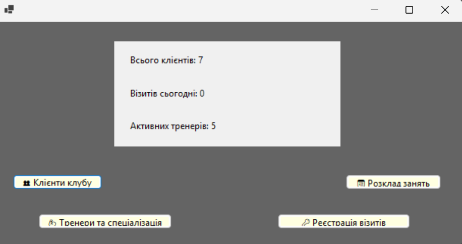
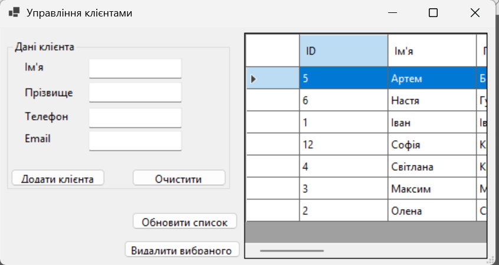
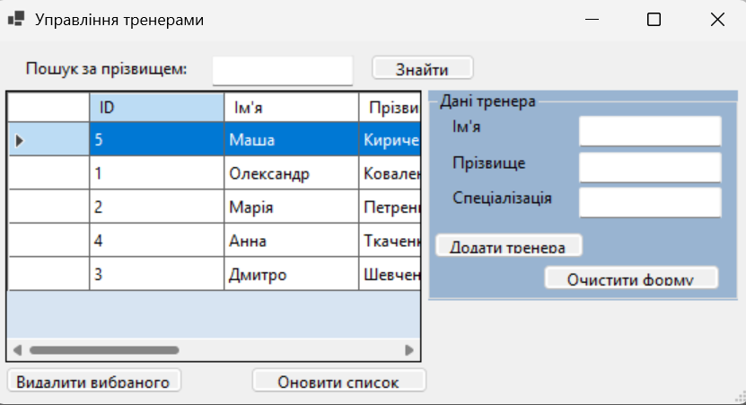
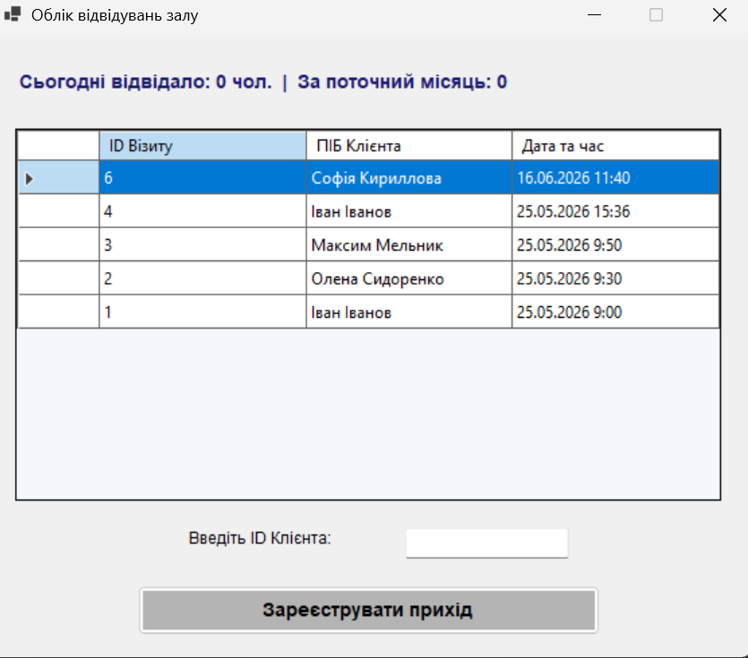
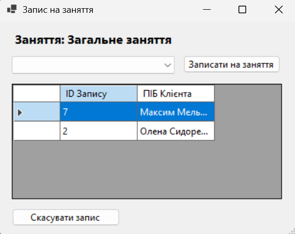

# FitnessClub — Information System

Desktop information system for managing a fitness club, built with **C# / Windows Forms** and **PostgreSQL**.

The app covers the core daily operations of a club: managing clients, trainers, memberships, visits and classes.

---

## Features

- **Clients** — create, edit, search and delete client records
- **Trainers** — manage trainer profiles and their specializations
- **Memberships** — issue memberships, track start/expiry dates and pricing
- **Visits** — log client visits
- **Classes** — schedule classes and register clients to them

## Tech Stack

| Layer | Technology |
|---|---|
| UI | Windows Forms (WinForms) |
| Language | C# (.NET 10) |
| Database | PostgreSQL |
| Data access | Npgsql (ADO.NET) |
| Architecture | Repository pattern |

## Project Structure

```
FitnessClub/
├── Database/
│   └── DbConnection.cs            — PostgreSQL connection
├── Models/
│   └── Model.cs                   — Client, Trainer, Membership, Visit, Class, ClassRegistration
├── Repositories/
│   ├── ClientRepository.cs        — CRUD for clients
│   ├── TrainerRepository.cs       — CRUD for trainers
│   └── OthersRepositories.cs      — memberships, visits, classes, registrations
├── Forms/
│   ├── ClientForm.cs              — clients
│   ├── TrainerForm.cs             — trainers
│   ├── VisitForm.cs               — visits
│   └── ClassRegistrationForm.cs   — classes & registrations
├── Form1.cs                       — main window / dashboard
├── Program.cs                     — entry point
├── fitnessclub.csproj             — project file
└── fitnessclub.slnx               — solution file
```

## Getting Started

### Prerequisites

- Visual Studio 2022 (or Rider) with .NET desktop development workload
- PostgreSQL 14+
- NuGet package **Npgsql** (restored automatically)

### Setup

1. Clone the repository:

```bash
git clone https://github.com/nastya12409/FitnessClub.git
cd FitnessClub
```

2. Create the database in pgAdmin or `psql`:

```sql
CREATE DATABASE fitnessclub;
```

3. Create the tables (see the list below) and set your credentials in `Database/DbConnection.cs`:

```csharp
private static readonly string ConnectionString =
    "Host=localhost;Port=5432;Username=postgres;Password=YOUR_PASSWORD;Database=fitnessclub";
```

> ⚠️ Keep a placeholder instead of a real password when publishing.

4. Open `fitnessclub.slnx` (or `fitnessclub.csproj`) in your IDE and run the project (**F5**).

## Database Schema

The database `fitnessclub` contains 6 tables:

| Table | Purpose |
|---|---|
| `clients` | club clients |
| `trainers` | trainers and their specializations |
| `memberships` | issued memberships |
| `visits` | visit log |
| `classes` | scheduled classes |
| `class_registrations` | clients registered to classes |

## Screenshots

**Main window**



**Clients**



**Trainers**



**Visits**



**Classes**



## Author

**Anastasiya** — final-year Software Engineering student, Odesa, Ukraine
GitHub: https://github.com/nastya12409
